# OQC 1v12 仿真环境使用指南

本环境旨在模拟一个完整的离线质量检测（OQC）工位。包含 1 个运动控制上层（主动驱动方）、1 套运动控制器和 12 个独立的测试仪器。

## 🏗 环境架构 (Architecture)

```mermaid
graph TD
    MCU[Mock 运动控制上层 :12300] -->|start/fail/pass| Software[Catalytic OQC 软件]
    Software -->|pass/fail| MCU
    Software --> Motion[MotionController :12301]
    Software --> Tester1[LegacyDevice Slot 1 :12303]
    Software --> Tester2[LegacyDevice Slot 2 :12304]
    Software --> Tester3[LegacyDevice Slot 3 :12305]
    Software --> Tester4[LegacyDevice Slot 4 :12306]
    Software --> Tester5[LegacyDevice Slot 5 :12307]
    Software --> Tester6[LegacyDevice Slot 6 :12308]
    Software --> Tester7[LegacyDevice Slot 7 :12309]
    Software --> Tester8[LegacyDevice Slot 8 :12310]
    Software --> Tester9[LegacyDevice Slot 9 :12311]
    Software --> Tester10[LegacyDevice Slot 10 :12312]
    Software --> Tester11[LegacyDevice Slot 11 :12313]
    Software --> Tester12[LegacyDevice Slot 12 :12314]
```



### 设备角色

| 角色 | 设备 | 端口 | 协议 | 说明 |
|:---|:---|:---|:---|:---|
| **主动驱动方** | Mock 运动控制上层 | **12300** | CSV 文本 | 主动发 start，收 pass/fail，校验一致性 |
| 运动控制 | MotionController | **12301** | `<CMD> <SLOT>` 文本 | 控制夹具机械动作 |
| 测试仪器 ×12 | LegacyDevice | **12303~12314** | SCPI 文本 | 每工位一台，独立端口 |

> ⚠️ 端口 **12302** 未使用（历史遗留，已废弃 TestInstrument）。

---

## 🚀 快速开始

1. **启动服务器**：
   在根目录下运行：
   ```bash
   dotnet run --project TestServer/TestServer.csproj
   ```
2. **验证端口**：
   服务器启动后，将占用以下端口：
   *   `12300`: Mock 运动控制上层（Catalytic 应作为 TCP Client 连接此端口）
   *   `12301`: 运动控制器
   *   `12303~12314`: Slot 1~12 的 LegacyDevice 测试器

---

## 📋 端口与协议一览

| 端口 | 设备 | 协议类型 | 命令终止符 | 响应终止符 | 文档 |
|:---|:---|:---|:---|:---|:---|
| **12300** | Mock 运动控制上层 | CSV 文本 | `\n` | `\n` | [MOTION_UPPER_SPEC](MOTION_UPPER_SPEC.md) |
| **12301** | MotionController | `<CMD> <SLOT>` 文本 | `\n` | `\n` | [MOTION_CONTROLLER_SPEC](MOTION_CONTROLLER_SPEC.md) |
| **12303** | LegacyDevice Slot 1 | SCPI 文本 | `\n` | `\n` | [LEGACY_DEVICE_SPEC](LEGACY_DEVICE_SPEC.md) |
| **12304** | LegacyDevice Slot 2 | SCPI 文本 | `\n` | `\n` | 同上 |
| **12305** | LegacyDevice Slot 3 | SCPI 文本 | `\n` | `\n` | 同上 |
| **12306** | LegacyDevice Slot 4 | SCPI 文本 | `\n` | `\n` | 同上 |
| **12307** | LegacyDevice Slot 5 | SCPI 文本 | `\n` | `\n` | 同上 |
| **12308** | LegacyDevice Slot 6 | SCPI 文本 | `\n` | `\n` | 同上 |
| **12309** | LegacyDevice Slot 7 | SCPI 文本 | `\n` | `\n` | 同上 |
| **12310** | LegacyDevice Slot 8 | SCPI 文本 | `\n` | `\n` | 同上 |
| **12311** | LegacyDevice Slot 9 | SCPI 文本 | `\n` | `\n` | 同上 |
| **12312** | LegacyDevice Slot 10 | SCPI 文本 | `\n` | `\n` | 同上 |
| **12313** | LegacyDevice Slot 11 | SCPI 文本 | `\n` | `\n` | 同上 |
| **12314** | LegacyDevice Slot 12 | SCPI 文本 | `\n` | `\n` | 同上 |

### 三种文本协议说明

| 协议 | 使用设备 | 格式示例 | 说明 |
|:---|:---|:---|:---|
| CSV 文本 | Mock 运动控制上层 | `start,0,1,5,8\n` / `pass,0,5\n` | 逗号分隔，slot 编号 0-based (0~11) |
| `<CMD> <SLOT>` 文本 | MotionController | `HOME 1\n` / `CLAMP_OK 1\n` | 空格分隔命令与 slot，slot 编号 1-based |
| SCPI 文本 | LegacyDevice | `*IDN?\n` / `MEAS:VOLT?\n` | 标准 SCPI 风格，不需要 slot 参数（端口已区分） |

---

## ⏱ 超时建议

| 场景 | 推荐超时 |
|:---|:---|
| TCP 连接 | 5000 ms |
| MotionController 命令 | 1000~2000 ms（HOME 最长） |
| LegacyDevice 基础命令 | 1000 ms |
| LegacyDevice TEST:DELAY | 3500 ms |
| MotionUpper 轮次完成 | 120000 ms |

详细配置请参考：[安全延迟配置表](SAFE_DELAY_CONFIG.md)

---

## 🧪 测试项命名参考

### 运动调度步骤
*   `HOME`: 机械复位
*   `CLAMP`: 治具压合
*   `UNCLAMP`: 治具释放

### LegacyDevice 测试项 (ID)
*   `TEST_IDN_VERIFY`: 设备识别
*   `TEST_SYS_ERR_CHECK`: 系统错误检查
*   `TEST_VOLT_MEASURE`: 电压测量
*   `TEST_CURR_MEASURE`: 电流测量
*   `TEST_HEALTH_STATUS`: 健康状态
*   `TEST_CONFIG_BACKUP`: 配置备份
*   `TEST_MEMORY_DUMP`: 内存转储
*   `TEST_WAVEFORM_CSV`: 波形数据
*   `TEST_STRESS_SLOW`: 慢响应测试 (1s)
*   `TEST_STRESS_DELAY`: 超长延迟测试 (3s)
*   `TEST_STRESS_GLITCH`: 乱码容错测试

### 计算测试项 (Catalytic Engine 侧)
*   `power = voltage * current`: 计算功率
*   `resistance = voltage / current`: 计算电阻
*   `temp_f = temp * 1.8 + 32`: 温度转换
*   `voltage_drop = 12.0 - voltage`: 计算压降

---
*注：本项目仅供仿真测试，用于验证 OQC 软件的复杂逻辑和解析性能。*
