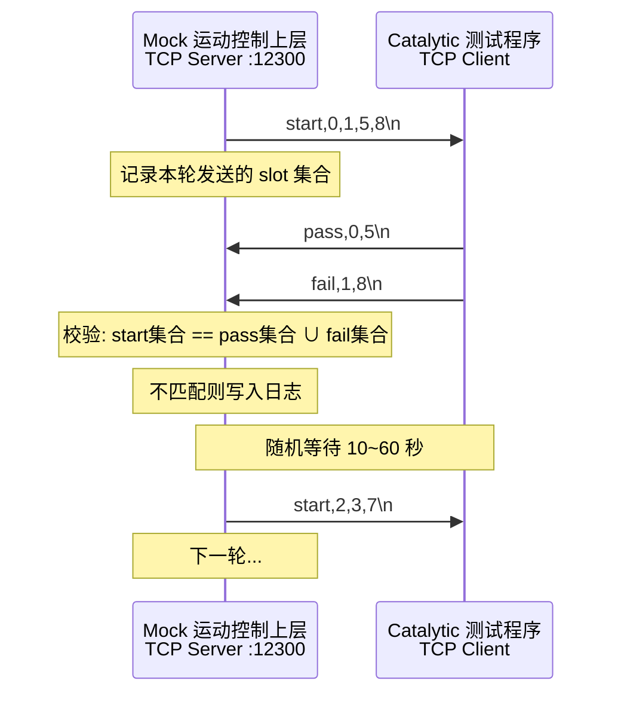
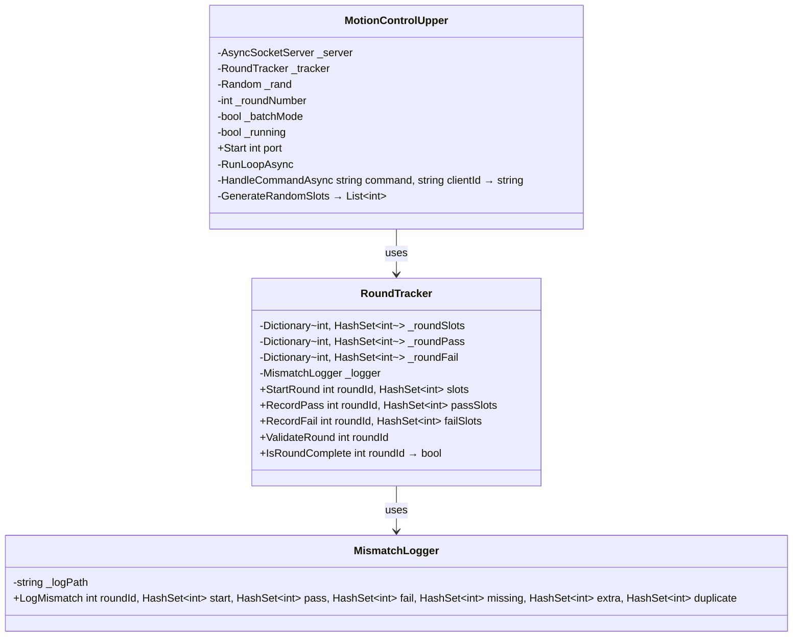

# Mock 运动控制上层 — 架构设计方案

## 1. 背景与目标

当前 TestServer 项目模拟的是"下位"设备：
- **MotionController**（端口 12301）— 运动控制卡，被动等待命令
- **12 个 LegacyDevice**（端口 12303~12314）— 测试仪器，被动等待命令

**缺少的是"上位"**：运动控制上层程序（机械手控制），它主动驱动测试流程。

本方案新增一个 **Mock 运动控制上层**，模拟机械手的行为，用于测试 Catalytic 测试程序的正确性。

---

## 2. 交互流程



### 2.1 消息格式（CSV 文本协议，\n 结尾）

| 方向 | 格式 | 示例 | 含义 |
|------|------|------|------|
| MCU → CAT | `start,<slot0>,<slot1>,...` | `start,0,1,5,8` | 通知可以测试的 slot 集合 |
| CAT → MCU | `pass,<slot0>,<slot1>,...` | `pass,0,5` | 这些 slot 测试通过 |
| CAT → MCU | `fail,<slot0>,<slot1>,...` | `fail,1,8` | 这些 slot 测试失败 |

### 2.2 关键设计决策

| 决策项 | 选择 | 理由 |
|--------|------|------|
| Slot 编号 | **0-based**（0~11） | 故意制造与 MotionController 的 1-based 不一致，测试 Catalytic 的容错能力 |
| pass/fail 消息 | **分两条** | 更贴近真实场景，对 Catalytic 解析能力是更好的测试 |
| 轮次间隔 | **随机 10~60 秒** | 模拟真实节拍不确定性 |
| 发送模式 | **批量 + 独立两种模式** | 批量模式为主，独立模式覆盖增量通知场景 |

---

## 3. 两种发送模式

### 3.1 批量模式（Batch Mode）

一次性把所有料放好，发一条 `start` 消息：

```
MCU → CAT: start,0,1,5,8\n
（等待 Catalytic 回完 pass + fail）
MCU → CAT: start,2,3,7,9,10\n
...
```

### 3.2 独立模式（Independent Mode）

每个 slot 独立放料，分别发 `start` 消息，间隔随机：

```
MCU → CAT: start,0\n
（随机 0.5~2 秒）
MCU → CAT: start,5\n
（随机 0.5~2 秒）
MCU → CAT: start,8\n
（等待 Catalytic 回完本轮所有 pass + fail）
MCU → CAT: start,1\n
...
```

### 3.3 模式切换

通过 `MotionControlUpper` 构造函数的 `bool batchMode` 参数切换：
- `batchMode = false`（默认）：批量模式（同步测试）
- `batchMode = true`：独立模式（异步测试）

在 `Program.cs` 中实例化时设置：
```csharp
var motionUpper = new MotionControlUpper(batchMode: false); // 批量模式
// var motionUpper = new MotionControlUpper(batchMode: true); // 独立模式
```

---

## 4. 校验逻辑

### 4.1 核心规则

每轮校验：
1. **pass 集合 ∪ fail 集合** 应该等于 **start 集合**
2. **pass 集合 ∩ fail 集合** 应该为空（一个 slot 不能既 pass 又 fail）
3. **数量**：|pass| + |fail| 应该等于 |start|

### 4.2 不匹配类型

| 不匹配类型 | 描述 | 示例 |
|------------|------|------|
| 缺少 slot | Catalytic 没有返回某个 slot 的结果 | start={0,1,5,8}, pass={0,5}, fail={1} → 缺少 slot 8 |
| 多余 slot | Catalytic 返回了 start 中没有的 slot | start={0,1}, pass={0,3} → 多余 slot 3 |
| 重复判定 | 同一 slot 同时出现在 pass 和 fail 中 | start={0}, pass={0}, fail={0} → slot 0 重复判定 |

### 4.3 日志格式

**只记录不匹配的情况**，保存到程序运行目录下的 `mismatch.log`：

```
[2026-04-28 11:30:45.123] [Round-003] MISMATCH
  Start:  [0, 1, 5, 8]
  Pass:   [0, 5]
  Fail:   [1]
  Missing: [8]
  Extra:  []
  Duplicate: []

[2026-04-28 11:35:12.456] [Round-007] MISMATCH
  Start:  [2, 3, 7]
  Pass:   [2, 3, 7, 11]
  Fail:   []
  Missing: []
  Extra:  [11]
  Duplicate: []
```

---

## 5. 类设计

### 5.1 类图



### 5.2 MotionControlUpper

**职责**：TCP Server + 轮次驱动

- 监听端口，接受 Catalytic 连接
- 主动发送 `start` 消息
- 接收 Catalytic 的 `pass`/`fail` 消息
- 管理轮次生命周期
- 构造函数接受 `bool batchMode = false`，默认批量模式

**关键流程 — 批量模式（batchMode = false）**：

```
1. 启动 TCP Server
2. 等待 Catalytic 连接
3. 进入轮次循环:
   a. 随机生成 slot 集合（1~12个）
   b. 发送一条 start 消息: start,0,1,5,8\n
   c. 记录本轮 slot 到 RoundTracker
   d. 等待 Catalytic 回复（pass + fail）
   e. 当 pass ∪ fail == start 时，轮次完成
   f. 校验结果，不匹配则记录日志
   g. 不匹配也继续下一轮（数据一次性给了，对不上就是 bug）
   h. 随机等待 10~60 秒
   i. 回到 a
```

**关键流程 — 独立模式（batchMode = true）**：

```
1. 启动 TCP Server
2. 等待 Catalytic 连接
3. 进入轮次循环:
   a. 随机决定本轮发几个 slot（1~12个）
   b. 逐个发送 start 消息，每条间隔随机 0.5~2 秒:
      start,0\n → 等 0.5~2s → start,5\n → 等 0.5~2s → start,8\n
   c. 记录本轮所有 slot 到 RoundTracker
   d. 等待 Catalytic 回复，每收到一条 pass/fail 就更新集合
   e. 当 pass ∪ fail == start 时，轮次完成
   f. 校验结果，不匹配则记录日志
   g. **如果对不上，卡住等待**，直到对上或超时（120秒）
   h. 超时则记录不匹配日志，强制进入下一轮
   i. 随机等待 10~60 秒
   j. 回到 a
```

**两种模式的核心区别**：
- 批量模式：对不上也继续下一轮（数据一次性给了，对不上就是 Catalytic 的 bug）
- 独立模式：对不上就卡住等（可能是 Catalytic 还没回完，也可能是 bug；超时 120 秒才判定为 bug）

### 5.3 RoundTracker

**职责**：轮次状态追踪与校验

- 记录每轮发出的 slot 集合
- 记录每轮收到的 pass/fail 集合
- 判断轮次是否完成（pass ∪ fail == start）
- 执行校验并输出不匹配结果

### 5.4 MismatchLogger

**职责**：不匹配日志持久化

- 只记录校验不通过的情况
- 写入程序运行目录下的 `mismatch.log`
- 格式清晰，便于排查问题

---

## 6. 与现有代码的集成

### 6.1 Program.cs 修改

```csharp
// 1. 启动 MotionController（现有，不变）
var motionController = new MotionController();
motionController.Start(12301);

// 2. 启动 12 个 LegacyDevice（现有，不变）
for (int i = 1; i <= 12; i++)
{
    var legacyDev = new LegacyDevice();
    legacyDev.Start(12302 + i, i);
}

// 3. 启动 Mock 运动控制上层（新增）
//    batchMode: false = 批量模式（同步），true = 独立模式（异步）
var motionUpper = new MotionControlUpper(batchMode: false);
motionUpper.Start(12300);
```

### 6.2 端口分配更新

| 设备 | 端口 | 协议 |
|------|------|------|
| **Mock 运动控制上层** | **12300** | **CSV 文本协议** |
| MotionController | 12301 | 文本协议 |
| LegacyDevice S1~S12 | 12303~12314 | SCPI 文本协议 |

---

## 7. 需要考虑的边界情况

1. **Catalytic 还没连接**：Mock 发 start 时没有客户端连接，需要缓存或等待
2. **Catalytic 中途断连**：需要处理重连场景
3. **Catalytic 超时不回复**：需要设置超时，超时后记录不匹配并开始下一轮
4. **一轮中只收到 pass 没有 fail**（或反过来）：这是合法的，只要集合能对上
5. **独立模式下，同一轮的多个 start 消息之间，Catalytic 可能穿插回复**：需要正确归并

---

## 8. 实施步骤

1. 创建 `TestServer/Devices/MotionControlUpper.cs` — 核心类
2. 创建 `TestServer/Core/RoundTracker.cs` — 轮次追踪器
3. 创建 `TestServer/Core/MismatchLogger.cs` — 不匹配日志记录器
4. 修改 `TestServer/Program.cs` — 集成新模块
5. 编写 `docs/MOTION_UPPER_SPEC.md` — 协议规格文档
